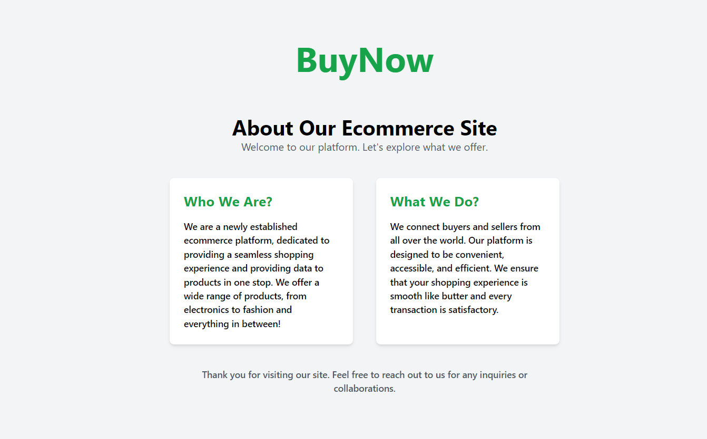
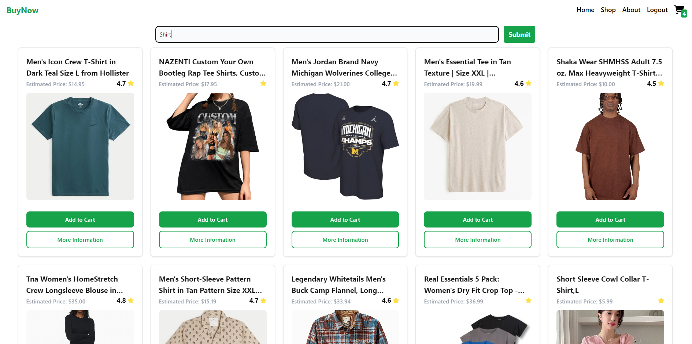
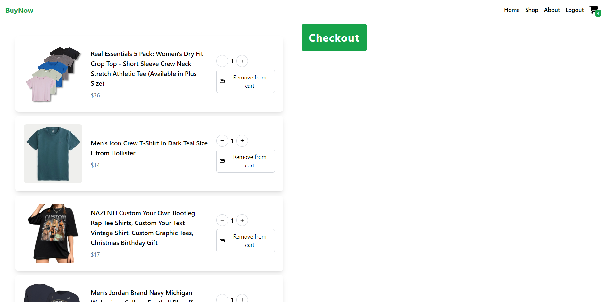

# BuyNow

BuyNow is a simple ecommerce app that allows users to search up their desired products and look for more information on them. They can also add the items to cart.

# Deployed Link

https://buynow-frontend.onrender.com

## Built With
* React 
* Express
* Node
* MongoDB
* Tailwind

## Usage
### Access account
Sign up and log in to account. Once logged in, user will be directed to the shop. 

Once you are logged in, you can use the search functionality to find what products you like. 

You can then access your cart. You can remove the item, increase or decrease the quantity.

